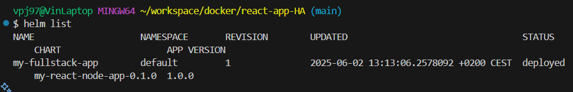
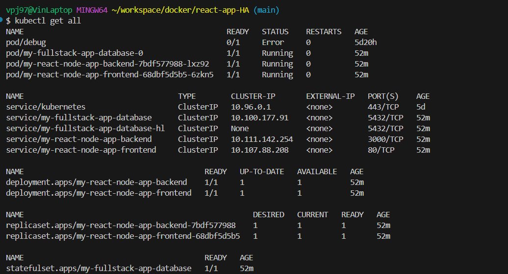
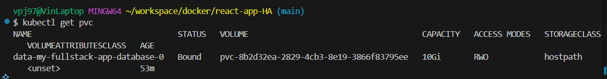
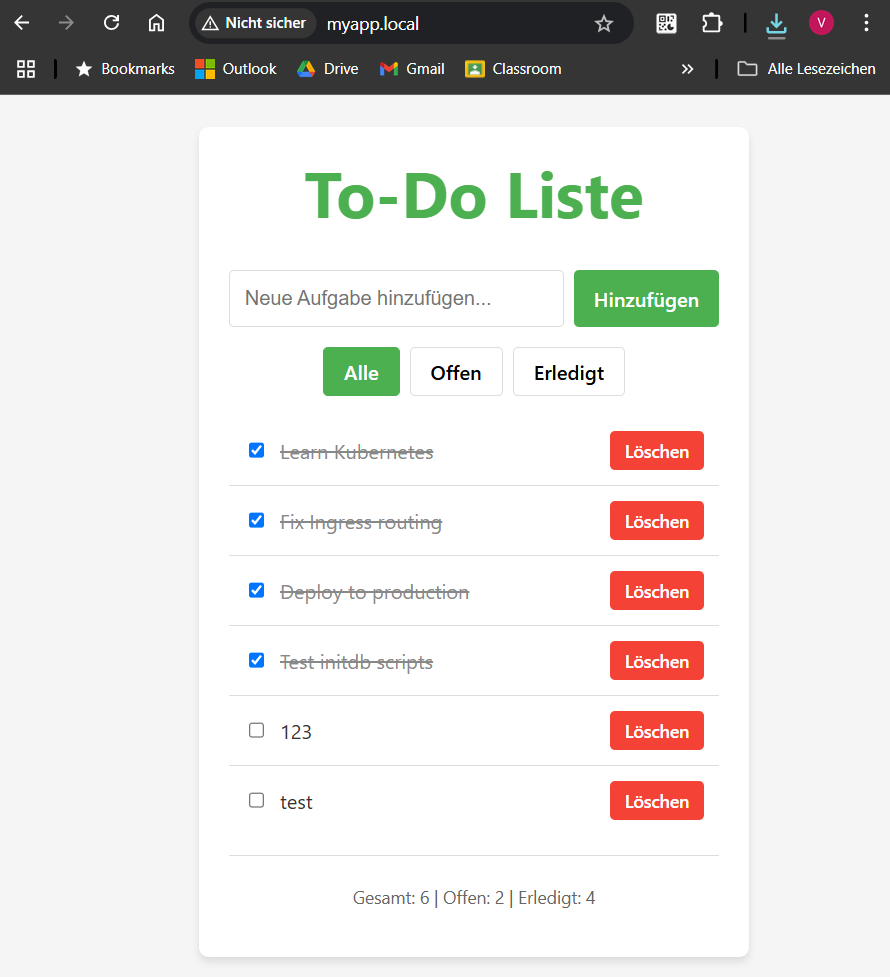
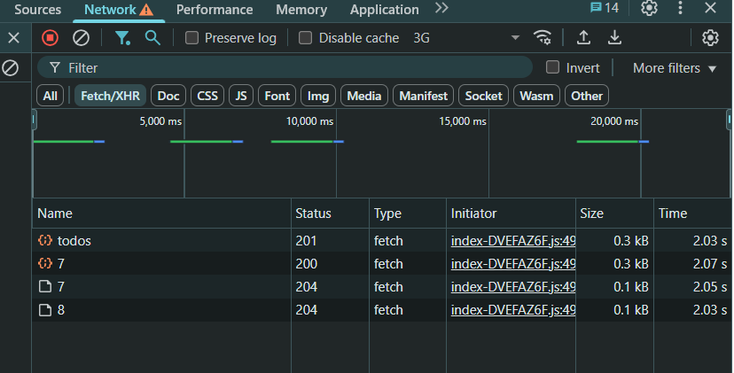
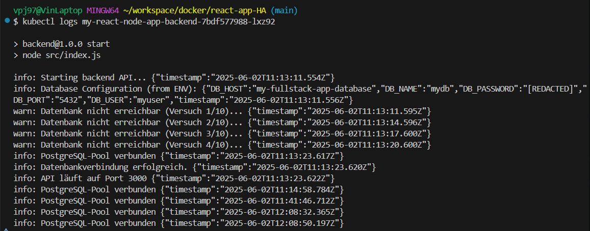
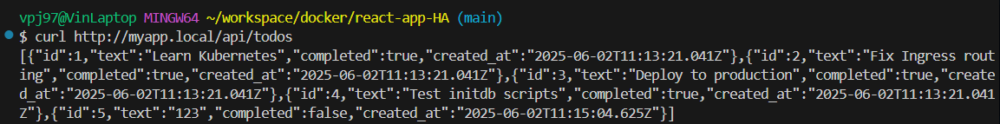

# Full-Stack Todo App – Helm Chart (React + Node.js + PostgreSQL)

Dies ist eine Full-Stack-Anwendung bestehend aus einem React-Frontend, einem Express-Backend und einer PostgreSQL-Datenbank. Die Anwendung ist als Helm Chart paketiert und kann in einem Kubernetes-Cluster installiert, aktualisiert und deinstalliert werden.

Die Architektur demonstriert den Aufbau einer modularen Microservice-Anwendung mit Subchart-Integration, Datenbank-Persistenz, und Ingress-Routing.

## Projektstruktur

```text
my-react-node-app/
├── charts/
│   └── postgresql-16.7.8.tgz    # PostgreSQL Subchart (Bitnami)
├── templates/
│   ├── backend-deployment.yaml  # Backend Deployment (Node.js API)
│   ├── backend-service.yaml     # Backend Service
│   ├── configmap.yaml          # Konfiguration (z.B. Logging, API URL)
│   ├── frontend-deployment.yaml # Frontend Deployment (React)
│   ├── frontend-service.yaml    # Frontend Service
│   ├── ingress.yaml            # Ingress-Routing (myapp.local)
│   └── _helpers.tpl            # Helper-Templates
├── values.yaml                  # Konfiguration aller Komponenten
├── Chart.yaml                   # Chart-Metadaten & Subchart-Dependency
├── .helmignore
└── README.md                    # Diese Datei
```

## Features

- **Frontend**: React + Vite + Nginx
- **Backend**: Node.js (Express) mit REST-API
- **PostgreSQL Subchart**: Integriert via Bitnami
- **Datenbank-Init**: init.sql über initdb.scripts
- **Ingress**: myapp.local als Hostname
- **Konfiguration**: Vollständig über values.yaml steuerbar
- **CRUD-API**: Todos erstellen, lesen, updaten, löschen
- **Healthchecks & Logging**: API-Healthcheck, Winston-Logger
- **Best Practices**: Templating, Subchart-Alias, ENV-Variablen

## Helm Befehle

### Installation

```bash
# PostgreSQL Subchart herunterladen
helm dependency update

# Chart installieren
helm install my-fullstack-app .
```

### Upgrade

```bash
helm upgrade my-fullstack-app .
```

### Deinstallation

```bash
helm uninstall my-fullstack-app
```

## Konfiguration

### values.yaml Highlights

```yaml
frontend:
  replicaCount: 1
  image:
    repository: vinjust/frontend-image
    tag: latest
  service:
    port: 80
  env:
    apiUrl: "/api"

backend:
  replicaCount: 1
  image:
    repository: vinjust/backend-image
    tag: latest
  service:
    port: 3000
  env:
    DB_HOST: my-fullstack-app-database
    DB_PORT: "5432"
    DB_NAME: mydb
    DB_USER: myuser
    DB_PASSWORD: mypassword #dummy password

database:
  auth:
    username: myuser
    password: mypassword #dummy password
    database: mydb
  primary:
    persistence:
      enabled: true
      size: 10Gi
    initdb:
      scripts:
        init.sql: |
          CREATE TABLE IF NOT EXISTS todos (
              id SERIAL PRIMARY KEY,
              title VARCHAR(255) NOT NULL,
              completed BOOLEAN DEFAULT FALSE,
              created_at TIMESTAMP DEFAULT NOW()
          );
          INSERT INTO todos (title, completed) VALUES
              ('Learn Kubernetes', false),
              ('Fix Ingress routing', true),
              ('Deploy to production', false),
              ('Test initdb scripts', false)
          ON CONFLICT DO NOTHING;

ingress:
  enabled: true
  className: nginx
  hosts:
    - host: myapp.local
```

## Sicherheit

### Sensible Daten

- **Lokale Tests**: Temporäre Passwörter (z. B. mypassword) können in values.yaml stehen, sind aber nur als Platzhalter/Dummy gedacht.
- **Deployment**: Passwörter sollten über --set (z. B. --set database.auth.password=...) oder eine separate, nicht eingecheckte Datei wie values-secret.yaml übergeben werden.
- **Alternative**: Passwörter sollten über --set (z. B. --set database.auth.password=...) oder eine separate, nicht eingecheckte Datei wie values-secret.yaml übergeben werden.

## Installation & Zugriff

1. Hosts-Datei anpassen:

```bash
echo "127.0.0.1 myapp.local" >> /etc/hosts
```

2. Im Browser aufrufen:

- [http://myapp.local](http://myapp.local)

## Validierung

### Nachweise (Screenshots)

#### 1. Helm Release Status



#### 2. Kubernetes Objekte



#### 3. Persistent Volume Claims



#### 4. Frontend im Browser



#### 5. API Requests im Network Tab



#### 6. Backend Logs



#### 7. API Test mit curl




## Best Practices

### Values.yaml Struktur

#### Was gehört in values.yaml

- **Deployment-Konfiguration**
  - `replicaCount`: Anzahl der Replikate
  - `image.repository` und `image.tag`: Docker Image Details
  - `service.port`: Exponierte Service Ports
  - `ingress.enabled`: Feature Flags
- **Anwendungskonfiguration**
  - Umgebungsvariablen
  - API-Endpunkte
  - Feature Flags
  - Logging Level

#### Was gehört NICHT in values.yaml

- Kubernetes Basis-Struktur (apiVersion, kind)
- Standard Container Ports (80/443)
- Unveränderliche Pfade (/app, /data)
- Basis-Labels und Selektoren

### PostgreSQL Subchart Integration

#### 1. Chart.yaml Konfiguration

```yaml
dependencies:
  - name: postgresql
    version: "16.7.8"
    repository: "https://charts.bitnami.com/bitnami"
    alias: database
```

#### 2. Sichere Subchart-Konfiguration

```yaml
database:
  auth:
    username: myuser
    # password wird via --set übergeben!
    database: mydb
  primary:
    persistence:
      enabled: true
      size: 10Gi
```

#### 3. Sicheres Deployment

```bash
# Mit mehreren --set Optionen
helm install my-fullstack-app . \
  --set database.auth.password=<secret> \
  --set backend.dbPassword=<secret>

# Alternativ mit values-secret.yaml
helm install my-fullstack-app . -f values-secret.yaml
```

### Secret Management Best Practices

1. **Entwicklung & Tests**

   - Temporäre Passwörter in lokaler `values-dev.yaml`
   - Nicht ins Git Repository committen
   - `.gitignore` für `*-secret.yaml` Dateien

2. **Staging & Produktion**

   - Secrets via External Secrets Operator
   - HashiCorp Vault Integration
   - Sealed Secrets für GitOps

3. **CI/CD Pipeline**
   - Secrets aus Key Vault/Secret Manager
   - Injection via Helm `--set` oder `-f`
   - Separate Secret Management für verschiedene Umgebungen
