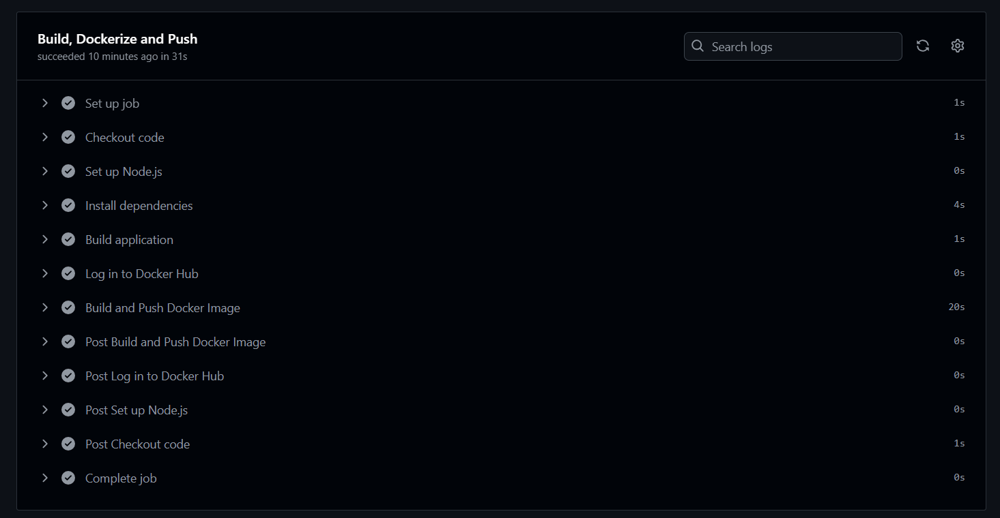
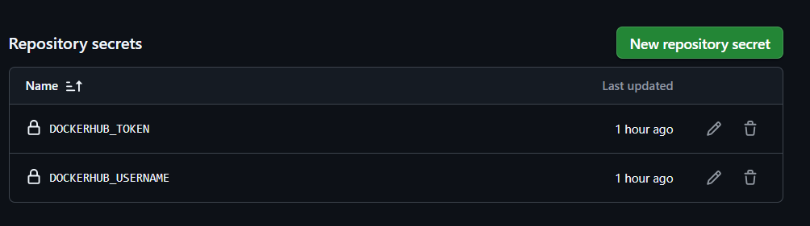
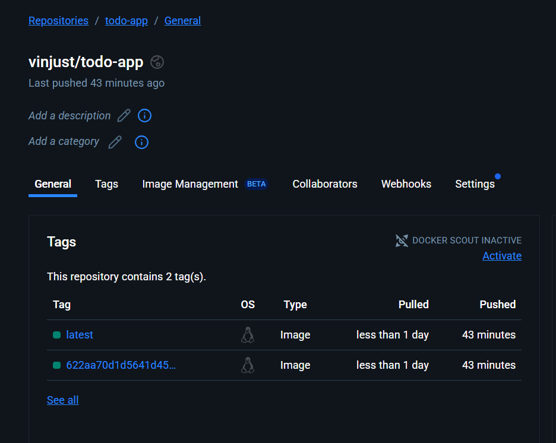

# Full-Stack Todo App – CI/CD Pipeline mit Docker & Helm Chart

## Aufgabe: CI-Pipeline vertiefen - Docker Image bauen und in Registry pushen

Dies ist eine Full-Stack-Anwendung bestehend aus einem React-Frontend, einem Express-Backend und einer PostgreSQL-Datenbank. Das Projekt demonstriert eine **vollständige CI/CD-Pipeline** mit:

- **Multi-Stage Docker Build** für die React-Anwendung
- **Automatisiertes Pushen** zu Docker Hub Registry
- **Sicheres Secret Management** in GitHub Actions
- **Helm Chart Deployment** für Kubernetes

Die Anwendung ist als Helm Chart paketiert und kann in einem Kubernetes-Cluster installiert, aktualisiert und deinstalliert werden. Die Architektur demonstriert den Aufbau einer modularen Microservice-Anwendung mit Subchart-Integration, Datenbank-Persistenz, und Ingress-Routing.

## Projektstruktur

```text
my-react-node-app/
├── charts/
│   └── postgresql-16.7.8.tgz    # PostgreSQL Subchart (Bitnami)
├── templates/
│   ├── backend-deployment.yaml  # Backend Deployment (Node.js API)
│   ├── backend-service.yaml     # Backend Service
│   ├── configmap.yaml           # Konfiguration (z.B. Logging, API URL)
│   ├── frontend-deployment.yaml # Frontend Deployment (React)
│   ├── frontend-service.yaml    # Frontend Service
│   ├── ingress.yaml             # Ingress-Routing (myapp.local)
│   └── _helpers.tpl             # Helper-Templates
├── .github/
│   └── workflows/ci.yml         # GitHub Actions Workflow
├── frontend/                    # Vite React App (Dockerized)
├── backend/                     # Express API mit DB-Anbindung
├── values.yaml                  # Konfiguration aller Komponenten
├── Chart.yaml                   # Chart-Metadaten & Subchart-Dependency
├── .helmignore
└── README.md                    # Diese Datei
```

## CI/CD Pipeline Features

### Multi-Stage Docker Build

Die React-Anwendung nutzt ein **Multi-Stage Dockerfile** für optimale Builds:

**Stage 1 - Builder:**
- Node.js Umgebung für den Build-Prozess
- Installation aller Abhängigkeiten (`npm ci`)
- React Build (`npm run build`)
- Vite-spezifische Optimierungen

**Stage 2 - Runner:**
- Schlankes `nginx:alpine` Base Image
- Kopiert nur die Build-Artefakte aus Stage 1
- Minimale finale Image-Größe
- Produktionsoptimierte Nginx-Konfiguration

**Vorteile:**
- Deutlich kleinere finale Images (nur ~20MB statt >1GB)
- Sicherheit: Keine Build-Tools in Production
- Schnellere Deployments durch geringere Image-Größe
- Bessere Caching-Performance in CI/CD

### CI/CD Pipeline Workflow

Die GitHub Actions Pipeline führt folgende Schritte aus:

1. **Code Checkout** - Holt den aktuellen Code
2. **Multi-Stage Build** - Baut das optimierte Docker Image
3. **Secure Login** - Authentifizierung bei Docker Hub über Secrets
4. **Image Push** - Upload mit eindeutigen Tags (latest + commit-hash)
5. **Verification** - Automatische Überprüfung des Registry-Uploads

## Features

### Application Stack
* **Frontend**: React + Vite + Nginx (Multi-Stage Docker Build)
* **Backend**: Node.js (Express) mit REST-API
* **PostgreSQL Subchart**: Integriert via Bitnami
* **Datenbank-Init**: init.sql über initdb.scripts
* **Ingress**: myapp.local als Hostname
* **Konfiguration**: Vollständig über values.yaml steuerbar
* **CRUD-API**: Todos erstellen, lesen, updaten, löschen
* **Healthchecks & Logging**: API-Healthcheck, Winston-Logger
* **CI/CD Pipeline**: GitHub Actions mit Docker Build & Push
* **Registry**: Docker Hub mit automatisiertem Image-Upload
* **Security**: Secret Management für Registry-Credentials

## Helm Befehle

### Installation

```bash
# PostgreSQL Subchart herunterladen
helm dependency update

# Chart installieren
helm install my-fullstack-app .
```

### Upgrade

```bash
helm upgrade my-fullstack-app .
```

### Deinstallation

```bash
helm uninstall my-fullstack-app
```

## Konfiguration

### values.yaml Highlights

```yaml
frontend:
  replicaCount: 1
  image:
    repository: vinjust/frontend-image
    tag: latest
  service:
    port: 80
  env:
    apiUrl: "/api"

backend:
  replicaCount: 1
  image:
    repository: vinjust/backend-image
    tag: latest
  service:
    port: 3000
  env:
    DB_HOST: my-fullstack-app-database
    DB_PORT: "5432"
    DB_NAME: mydb
    DB_USER: myuser
    DB_PASSWORD: mypassword #dummy password

database:
  auth:
    username: myuser
    password: mypassword #dummy password
    database: mydb
  primary:
    persistence:
      enabled: true
      size: 10Gi
    initdb:
      scripts:
        init.sql: |
          CREATE TABLE IF NOT EXISTS todos (
              id SERIAL PRIMARY KEY,
              title VARCHAR(255) NOT NULL,
              completed BOOLEAN DEFAULT FALSE,
              created_at TIMESTAMP DEFAULT NOW()
          );
          INSERT INTO todos (title, completed) VALUES
              ('Learn Kubernetes', false),
              ('Fix Ingress routing', true),
              ('Deploy to production', false),
              ('Test initdb scripts', false)
          ON CONFLICT DO NOTHING;

ingress:
  enabled: true
  className: nginx
  hosts:
    - host: myapp.local
```

## Sicherheit

### Sensible Daten

* **Lokale Tests**: Temporäre Passwörter (z. B. mypassword) können in values.yaml stehen, sind aber nur als Platzhalter/Dummy gedacht.
* **Deployment**: Passwörter sollten über --set (z. B. --set database.auth.password=...) oder eine separate, nicht eingecheckte Datei wie values-secret.yaml übergeben werden.

## Installation & Zugriff

1. Hosts-Datei anpassen:

```bash
echo "127.0.0.1 myapp.local" >> /etc/hosts
```

2. Im Browser aufrufen:

* [http://myapp.local](http://myapp.local)


## Best Practices

### Values.yaml Struktur

#### Was gehört in values.yaml

* **Deployment-Konfiguration**

  * `replicaCount`: Anzahl der Replikate
  * `image.repository` und `image.tag`: Docker Image Details
  * `service.port`: Exponierte Service Ports
  * `ingress.enabled`: Feature Flags
* **Anwendungskonfiguration**

  * Umgebungsvariablen
  * API-Endpunkte
  * Feature Flags
  * Logging Level

#### Was gehört NICHT in values.yaml

* Kubernetes Basis-Struktur (apiVersion, kind)
* Standard Container Ports (80/443)
* Unveränderliche Pfade (/app, /data)
* Basis-Labels und Selektoren

### PostgreSQL Subchart Integration

#### 1. Chart.yaml Konfiguration

```yaml
dependencies:
  - name: postgresql
    version: "16.7.8"
    repository: "https://charts.bitnami.com/bitnami"
    alias: database
```

#### 2. Sichere Subchart-Konfiguration

```yaml
database:
  auth:
    username: myuser
    # password wird via --set übergeben!
    database: mydb
  primary:
    persistence:
      enabled: true
      size: 10Gi
```

#### 3. Sicheres Deployment

```bash
# Mit mehreren --set Optionen
helm install my-fullstack-app . \
  --set database.auth.password=<secret> \
  --set backend.dbPassword=<secret>

# Alternativ mit values-secret.yaml
helm install my-fullstack-app . -f values-secret.yaml
```

### Secret Management Best Practices

1. **Entwicklung & Tests**

   * Temporäre Passwörter in lokaler `values-dev.yaml`
   * Nicht ins Git Repository committen
   * `.gitignore` für `*-secret.yaml` Dateien

2. **Staging & Produktion**

   * Secrets via External Secrets Operator
   * HashiCorp Vault Integration
   * Sealed Secrets für GitOps

3. **CI/CD Pipeline**

   * Secrets aus Key Vault/Secret Manager
   * Injection via Helm `--set` oder `-f`
   * Separate Secret Management für verschiedene Umgebungen

# CI/CD Nachweise

## 1. Erfolgreicher Lauf der CI-Pipeline (GitHub Actions)




---

## 2. GitHub Repository Secrets (Werte unkenntlich)




---

## 3. Docker Hub Repository mit Tags




---

## Zusätzliche Informationen

- **Pipeline Status**: Erfolgreich
- **Docker Registry**: Docker Hub
- **Sicherheit**: Alle sensiblen Daten sind als GitHub Secrets hinterlegt
- **Automatisierung**: Vollständig automatisierte CI/CD-Pipeline

## Reflexionsfragen zur CI/CD Aufgabe

### 1. Multi-Stage Dockerfile: Builder vs. Runner
**Builder Stage (Node.js):**
- Führt `npm ci` und `npm run build` aus
- Erstellt optimierte Production-Builds
- Enthält alle Build-Dependencies und Tools

**Runner Stage (nginx:alpine):**
- Kopiert nur die fertigen Build-Artefakte (`dist/` Ordner)
- Schlankes Production-Image ohne Build-Tools
- Sicherheitsvorteile: Keine unnötigen Dependencies in Production

**CI/CD Vorteile:**
- Konsistente Build-Umgebung unabhängig vom lokalen Setup
- Kleinere Images = schnellere Deployments
- Bessere Sicherheit durch minimale Attack Surface

### 2. Secure Secret Management
**Implementierung:**
- Docker Hub Credentials als GitHub Repository Secrets gespeichert
- `DOCKERHUB_USERNAME` und `DOCKERHUB_TOKEN` über GitHub UI konfiguriert
- Zugriff in Pipeline über `${{ secrets.SECRET_NAME }}`

**Sicherheitsvorteile:**
- Credentials niemals im Code-Repository sichtbar
- Verschlüsselte Speicherung in GitHub
- Granulare Zugriffskontrolle auf Secret-Ebene
- Audit-Trail für Secret-Nutzung

### 3. Pipeline-Workflow (4 Hauptschritte)
1. **Code Checkout** - GitHub Actions holt aktuellen Code-Stand
2. **Docker Build** - Multi-Stage Build mit optimierter React-App
3. **Registry Login** - Sichere Authentifizierung bei Docker Hub
4. **Image Push** - Upload mit eindeutigen Tags für Versionierung

### 4. Image Tagging Strategie
**Verwendete Tags:**
- `latest` - Immer der neueste Main-Branch Build
- `<commit-hash>` - Eindeutige Identifikation jedes Builds (z.B. `622aa70d1d5641d45...`)

**Wichtigkeit eindeutiger Tags:**
- Reproduzierbare Deployments
- Rollback-Möglichkeiten zu spezifischen Versionen
- Nachverfolgbarkeit von Changes
- Parallele Umgebungen (Dev/Staging/Prod) mit verschiedenen Versionen

### 5. Troubleshooting Docker Push Failures
**Systematisches Vorgehen:**
1. **Pipeline Logs analysieren** - GitHub Actions Workflow Details
2. **Secret Verification** - Korrektheit von DOCKERHUB_USERNAME/TOKEN prüfen
3. **Registry Connectivity** - Netzwerk/Firewall Issues ausschließen
4. **Permissions Check** - Docker Hub Repository-Berechtigungen validieren
5. **Local Testing** - Manueller `docker login` und `docker push` Test
6. **Token Expiry** - Docker Hub Access Token Gültigkeit überprüfen
