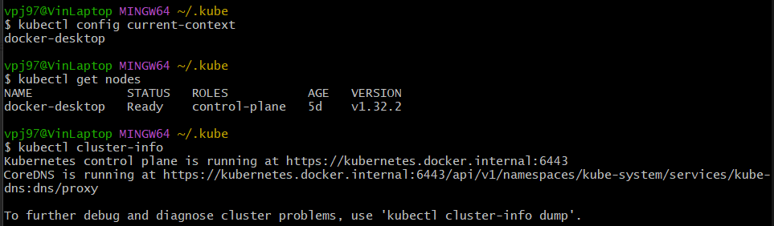

# Screenshot – Nachweis des laufenden Clusters

Der folgende Screenshot zeigt, dass mein lokales Kubernetes-Cluster erfolgreich läuft und `kubectl` korrekt verbunden ist:

# Reflexionsfragen

### Welche Methode hast du zum Aufsetzen deines lokalen Kubernetes Clusters gewählt (Docker Desktop, Minikube, Kind) und warum?

Ich habe Docker Desktop verwendet, weil es bereits installiert war und die Kubernetes-Integration einfach zu aktivieren ist.

### Beschreibe in eigenen Worten, was die Control Plane eines Kubernetes Clusters ist und welche Kernrolle sie hat (ohne spezifische Komponenten wie etcd, Scheduler etc. im Detail zu nennen).

Die Control Plane steuert den gesamten Cluster. Sie verwaltet den gewünschten Zustand und verteilt Aufgaben an die Worker Nodes.

### Was ist die Rolle eines Worker Node in einem Kubernetes Cluster?

Ein Worker Node führt Container in Pods aus und stellt die Ressourcen wie CPU und Speicher dafür bereit.

### Der Befehl kubectl ist das Kommandozeilen-Tool zur Interaktion mit Kubernetes. Mit welchem zentralen Bestandteil der Kubernetes Architektur spricht kubectl direkt, wenn du einen Befehl absetzt?

`kubectl` spricht direkt mit dem API Server der Control Plane.

### Wie hast du praktisch überprüft, dass kubectl erfolgreich eine Verbindung zu deinem lokalen Cluster herstellen konnte? Welche Befehle hast du dafür genutzt, und was hast du als erfolgreiche Ausgabe erwartet?

Ich habe `kubectl config current-context`, `kubectl get nodes` und `kubectl cluster-info` genutzt. Die erwartete Ausgabe war der aktive Kontext, ein Node mit Status "Ready" und die Adresse des API Servers.

### Basierend auf dem Theorieteil: Erkläre kurz die Kernidee der deklarativen Philosophie von Kubernetes.

Man beschreibt den gewünschten Zustand, z. B. wie viele Pods laufen sollen, und Kubernetes sorgt automatisch dafür, dass dieser Zustand erreicht und gehalten wird.

